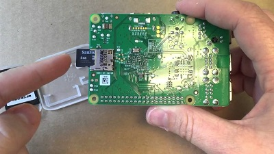
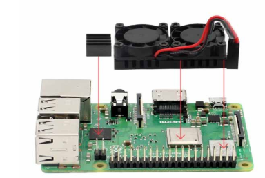

= Tutorial Title Name

Author: Ryan Stricker

== Intro

This tutorial will guide you through the process of creating your own Portable RetroPi Console.

== Prerequisites

In order to proceed with this tutorial you will need: 

* a RaspberryPi (I've used a Pi-B+ with this build.) 
* a 5 to 7 inch LCD screen
* a case for the RaspberryPi & a case for the entire build to be mounted into. (includes screen, speaker, battery pack, room for cords, etc.)
* a battery pack (5600mah)
* 6inch HDMI cord
* a heatsink & fan for the RaspberryPi
* HDMI adapter
* An SD card with the RetroPi OS to be able to run games

== Instructions

. Step one.
+
```
The first step that we will need to take, is to insert the SD card into the RaspberryPi.
```
+		


. Step two.
+
```
The second step is to install the RaspberryPi to its case. 
```
```
For this build, I have gone with an open case where I only have to connect the bottom half of the RaspberryPi to it.
```
```
After the RaspberryPi has been installed to it's case, proceed to install the HeatSink/Fan to the RaspberryPi.
```
+		

image is placeholder


. Step three. 
+
```
Place the RaspberryPi inside of the entire case and glue it in place. 
```

. Step four. 
+
Place the Screen in the top half of the closeable plastic case, glue it in place.

. Step five. 
+
```
Connect the HDMI from the screen to the RaspberryPi
```
. Step six. 
+
```
Connect the speaker to the raspberrypi. Glue it in place. 
```
. Step seven. 
+
```
Connect the raspberrypi to the battery pack in order to give it power. Turn the power pack on, the raspberrypi on and play the retro console with an external controller! 
```


