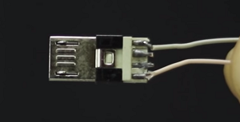

= How to Build Your Own RaspberryPi RetroConsole!

Author: Ryan Stricker

== Intro

This tutorial will guide you through the process of creating your own Portable RetroPi Console.

== Prerequisites

In order to proceed with this tutorial you will need: 

* a RaspberryPi (I've used a Pi-B+ with this build.)
+
 
(image is placeholder)
* a 5 to 7 inch LCD screen
+

(image is placeholder)
* a case for the RaspberryPi & a case for the entire build to be mounted into. (includes screen, speaker, battery pack, room for cords, etc.)
+

(image is placeholder)
* a battery pack (5600mah)
+

(image is placeholder)
* 6inch HDMI cord
+

* a heatsink & fan for the RaspberryPi
+

* An SD card with the RetroPi OS to be able to run games

== Instructions

. Step one.
+
```
The first step that we will need to take, is to insert the SD card into the RaspberryPi.
```
+		
image::raspbpiSD.png[]
(image is placeholder)

. Step two.
+
```
The second step is to install the RaspberryPi to its case. 
For this build, I have gone with an open case,
where I only have to connect the bottom half of the RaspberryPi to it.
After the RaspberryPi has been installed to it's case,
proceed to install the HeatSink/Fan to the RaspberryPi.
```
+		
image::heatsinkfan.png[]
(image is placeholder)


. Step three. 
+
```
Place the RaspberryPi inside of the entire case,
Make sure the location you want to put it in will leave room for the other parts.
Use marker to map out the locations of USB ports to cutout
Remove the RaspberryPi and cut out the locations of ports. 
Place the Pi back inside to make sure everything fits. 
```

. Step four. 
+
```
Place the Screen in the top half of the closeable plastic case.
You tape it in place or glue it in place with heatproof tape or glue. 
Connect the HDMI from the screen to the RaspberryPi

```
. Step five. 
+
```
Place the battery pack inside of the case,
User marker to mark the locations where you will want the power button & charging port
Remove the battery pack to cut out the locations
```
. Step six. 
+
```
Open the battery pack up to reveal where the batteries connect to the USB
```

+


```
Separate out a red and black wire,
connect the wires to the usb by using the soldering iron
```
+

+
```
Get out a male micro usb head, as well as a power switch
```

+


```
connect the red wire to the powerswitch
and the black wire to the male usb head with the soldering iron
```

+

+
image::powerbutton2.png[]

```
connect the powerswitch to the usb head.
test that it works with turning the battery pack on,
and turning on the raspberrypi
turn it off and place the battery pack in the case
place the switch in to its open port and glue it in place
```
. Step seven. 
+
```
Once done, glue the powerpack and the raspberry pi in place.
Add the speaker to the inside of the case and glue it in place
Plug the speaker into the RaspberryPi
```
+

```
Turn the power pack on,
the screen, raspberrypi and the speaker should all activate.
Cover the inside of the case to keep its contents secure.
```
+
image::finishedcase.png[]
```
Plug in your controller and begin playing your Retro Console!
```

* all placeholder images were taken from this video: https://www.youtube.com/watch?v=pFho9bYt6Us&t=205s


== Challenge
If this is your first time using a soldering iron, then this will help open up your world to being able to solder more projects together. 
This project should open up new ideas of what to do with a RaspberryPi, as there are a variety of projects to do with them. 

== Reflection
Has this project helped you come up with another idea to create with a RaspberryPi?
